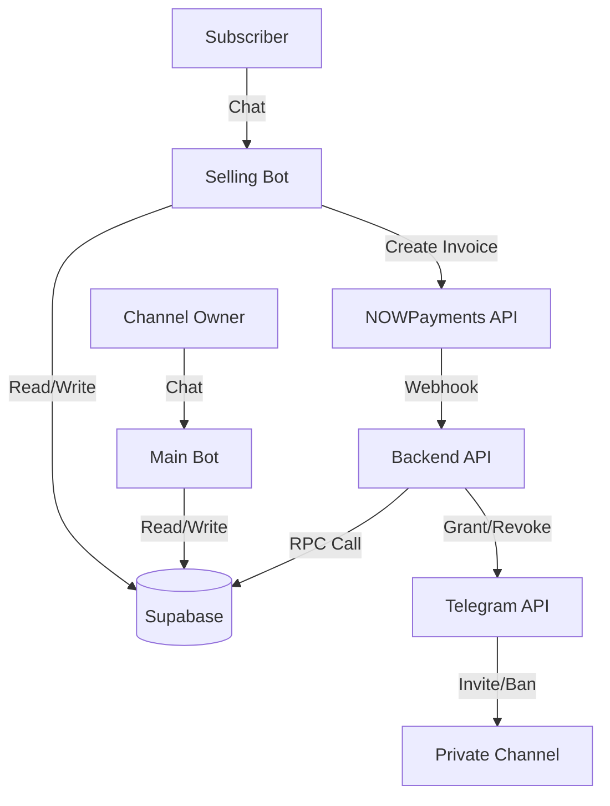

# SubscribeHub Project Context

**Version:** 1.0\
**Last Updated:** February 1, 2026

---

## 1. System Overview

**SubscribeHub** is a white-label Telegram subscription automation platform. It
allows "Clients" (channel owners) to create and manage their own "Selling Bots"
that automatically sell subscriptions, accept crypto payments, and manage user
access to private Telegram channels or groups.

### Core Value Proposition

- **White-label**: Clients brand their own bots.
- **Non-custodial**: Payments go directly to Client wallets via NOWPayments.
- **Automated**: Instant access granting and revocation upon subscription
  expiry.
- **Platform Model**: SubscribeHub charges Clients a subscription fee for using
  the platform (tiered limits).

---

## 2. Technical Architecture

The system follows a **Dual-Bot Architecture** supported by a central backend
and database.

### Components

1. **Main Bot (`src/main-bot`)**
   - **Role**: Control plane for Clients.
   - **Functions**: Client registration, Selling Bot creation/management, Plan
     configuration, Platform billing.
   - **Tech**: `grammy`, `grammy-conversations`.

2. **Selling Bot (`src/selling-bot`)**
   - **Role**: Customer-facing interface for Subscribers.
   - **Functions**: Plan selection, Crypto payment generation, Subscription
     status check, Support.
   - **Tech**: `grammy`, Factory pattern (one codebase running multiple bot
     instances).

3. **Backend API (`src/backend`)**
   - **Role**: Central processing unit.
   - **Functions**:
     - **Webhooks**: NOWPayments IPN handler (`/webhooks/nowpayments`).
     - **CRON Jobs**: Expiration checks, Trial management, Reminders.
     - **Services**: Access Control (Telegram API interaction).
   - **Tech**: `fastify`, `node-cron`.

4. **Database (`src/database`)**
   - **Tech**: Supabase (PostgreSQL).
   - **Security**: Row Level Security (RLS) enabled on all tables.

### Data Flow



---

## 3. Technology Stack

- **Runtime**: Node.js (>=20.0.0)
- **Language**: TypeScript
- **Package Manager**: NPM
- **Frameworks**:
  - `fastify` (API)
  - `grammy` (Telegram Bots)
- **Database**: Supabase (PostgreSQL)
- **ORM/Query**: `supabase-js` (Client), Raw SQL (Migrations)
- **Integrations**:
  - **NOWPayments**: Crypto payment gateway.
  - **Telegram Bot API**: Interaction interface.
- **Testing**: `vitest`
- **Logging**: `pino`

---

## 4. Database Schema

Key tables and their purposes:

| Table                  | Purpose                         | Key Fields                                                                      |
| ---------------------- | ------------------------------- | ------------------------------------------------------------------------------- |
| `clients`              | Platform users (Channel Owners) | `telegram_user_id`, `status` (TRIAL/ACTIVE), `subscription_plan_id`             |
| `selling_bots`         | Bots owned by clients           | `bot_token` (Encrypted), `nowpayments_api_key` (Encrypted), `linked_channel_id` |
| `subscription_plans`   | Plans created by clients        | `price_amount`, `duration_days`, `max_bots`, `max_subscribers`                  |
| `subscribers`          | End-users buying access         | `telegram_user_id`, `subscription_status`, `subscription_end_date`              |
| `payment_transactions` | Audit trail of payments         | `nowpayments_invoice_id`, `payment_status`, `amount`, `currency`                |
| `access_control_logs`  | Audit of grants/revokes         | `action` (GRANT/REVOKE), `reason`, `performed_by`                               |
| `platform_admins`      | System administrators           | `telegram_user_id`, `role`                                                      |

---

## 5. Critical Business Logic

### 5.1 Payment & Access Flow (Atomic)

1. **Invoice**: Subscriber requests plan -> Selling Bot calls NOWPayments ->
   Returns payment URL.
2. **Payment**: Subscriber pays -> NOWPayments sends IPN webhook to Backend.
3. **Validation**: Backend validates HMAC signature & timestamp (Replay
   Protection).
4. **Processing**: Calls `process_payment_webhook` (PostgreSQL RPC).
   - **Locks** row to prevent race conditions.
   - **Updates** transaction status.
   - **Extends** subscription end date.
5. **Access Grant**: Backend Side-effect logic:
   - Generates **single-use invite link** via Telegram API.
   - Sends link to Subscriber via Selling Bot.

### 5.2 Access Revocation Strategy

- **Trigger**: Hourly CRON job (`expiration-check.ts`) finds expired
  subscriptions.
- **Action**: `revokeChannelAccess` service.
- **Method**: "Ban-then-Unban" trick.
  1. `banChatMember`: Kicks user and prevents immediate rejoin.
  2. Wait 60s (logic actually does step 3 immediately in current code).
  3. `unbanChatMember`: Removes ban from list, allowing future re-subscription.

### 5.3 Encryption & Security

- **Algorithm**: AES-256-GCM.
- **Scope**: `bot_token` and `nowpayments_api_key` are encrypted at rest.
- **RLS**: Database policies restrict access. Service role (Backend) bypasses
  RLS; Public role has zero access (except active plans).
- **CORS**: Restricted in production (Fatal error if wildcard `*` used).

---

## 6. Recent Audits & Known State

**Production Readiness Score**: 7/10 (As of Feb 1, 2026)

### Critical Fixes Implemented (Feb 2026)

- ✅ **Replay Protection**: Webhooks older than 5 mins are rejected.
- ✅ **Decrypt Error Handling**: Failed decryptions are logged, not ignored.
- ✅ **Limit Enforcement**: `max_bots` and `max_subscribers` plan limits are now
  strictly enforced.
- ✅ **CORS Security**: Server refuses to start with wildcard CORS in
  production.
- ✅ **Test Coverage**: Added core tests for Payments, Access Control, and
  Limits (52 tests passed).

### Known Limitations (Future Roadmap)

1. **Queue System**: Webhooks process immediately. Needs Redis/BullMQ for
   retries and fault tolerance.
2. **Worker Separation**: Selling Bots run in the same process as Main Bot.
   Should be separated for scale.
3. **User Notifications**: Clients are not notified when a new Subscriber joins
   (REQ-SB-060).
4. **Formatting**: Mix of HTML and Markdown parse modes (Consistency needed).

---

## 7. Developer Guide

### Running Locally

```bash
# Install dependencies
npm install

# Start development (all services)
npm run dev

# Run tests
npm test
```

### Environment Variables (.env)

- `SUPABASE_URL`, `SUPABASE_SERVICE_ROLE_KEY`: Database access.
- `MAIN_BOT_TOKEN`: Grammy token for main bot.
- `NOWPAYMENTS_IPN_SECRET`: For webhook validation.
- `ENCRYPTION_KEY`: 32-byte hex string for AES-256.
- `ADMIN_API_KEY`: Static key for internal API protection.

### Directory Structure

- `src/backend`: API Server & Jobs.
- `src/main-bot`: Admin & Client Bot logic.
- `src/selling-bot`: Subscriber Bot logic.
- `src/shared`: Utilities, Config, Types.
- `src/database`: DB Client & Migrations.
- `docs/`: PRD & User Journeys, PROJECT_CONTEXT.md.
- `tests/`: Vitest test suites.
